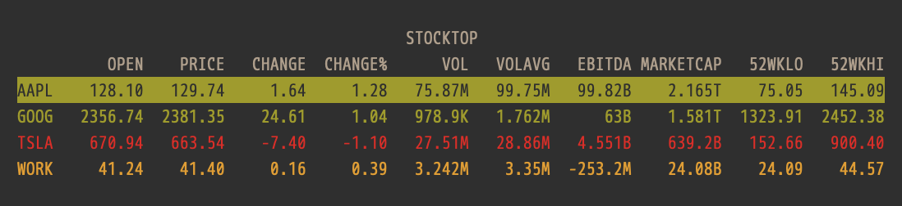

# stocktop



A command-line utility for tracking stock prices based on `ncurses`.

## Dependencies

- `make`
- `libcurl`
- `libjson-c`
- `libncurses`

If you want to run the test suite, you'll also need `libcheck`.

## Building 

```bash
$ make && build/stocktop
```

## To Do

- [x] Color highlighting
- [x] Read/write stock symbols to rc file. Allow user to add/remove their own
  symbols
- [x] Handle mis-spelled or non-existent symbols that return no data
- [x] Provide keystroke to refresh stock data
- [ ] Allow user to sort by each field
- [ ] Make UI fill the space of the terminal window
